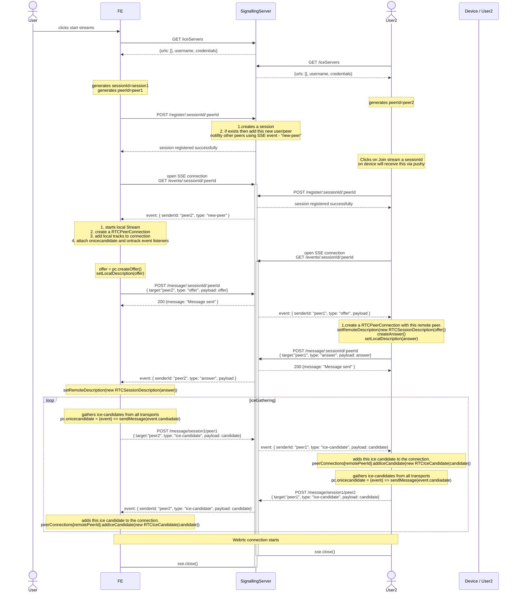

```mermaid

sequenceDiagram
	Actor User

	participant FE AS FE
  participant SS AS SignallingServer
  Actor User2
  # participant BE AS BE
  participant D AS Device / User2

  User->>FE: clicks start streams

  FE->> SS:  GET /iceServers
  SS-->>FE: {urls: [], username, credentials}
  User2->> SS:  GET /iceServers
  SS-->>User2: {urls: [], username, credentials}

  Note over FE: generates sessionId=session1 <br/> generates peerId=peer1
  Note over User2:  generates peerId=peer2
  FE->> SS: POST /register/:sessionId/:peerId
  Note over SS: 1.creates a session <br/> 2. if exists then add this new user/peer <br/>  notifity other peers using SSE event - "new-peer"
  SS-->>FE: session registered successfully

  Note over User2: Clicks on Join stream a sessionId <br/> on device will receive this via pushy


  FE ->>+SS: open SSE connection <br/> GET /events/:sessionId/:peerId
  User2->>SS: POST /register/:sessionId/:peerId
  SS-->>User2: session registered successfully
  SS -->> FE: event: { senderId: "peer2", type: "new-peer" }
  Note over FE: 1. starts local Stream <br/> 2. create a RTCPeerConnection <br/> 3. add local tracks to connection <br/> 4. attach onicecandidate and ontrack event listeners
  User2 ->>+SS: open SSE connection <br/> GET /events/:sessionId/:peerId
  Note over FE:  offer = pc.createOffer() <br/> setLocalDescription(offer)

  FE->> SS: POST /message/:sessionId/:peerId <br/> { target:"peer2", type: "offer", payload: offer}
  SS-->>FE: 200 {message: "Message sent" }
  SS-->>User2: event: { senderId: "peer1", type: "offer", payload }
  Note over User2: 1.create a RTCPeerConnection with this remote peer. <br/> setRemoteDescription(new RTCSessionDescription(offer)) <br/> createAnswer() <br/>setLocalDescription(answer)

   User2->> SS: POST /message/:sessionId/:peerId <br/> { target:"peer1", type: "answer", payload: answer}
   SS-->>User2: 200 {message: "Message sent" }
   SS-->>FE: event: { senderId: "peer2", type: "answer", payload }
   Note over FE: setRemoteDescription(new RTCSessionDescription(answer))

   loop iceGathering
   		Note over FE: gathers ice-candidates from all transports <br/> pc.onicecandidate = (event) => sendMessage(event.candiadate)
   		FE-->>SS: POST /message/session1/peer1 <br/> { target:"peer2", type: "ice-candidate", payload: candidate}
   		SS-->>User2: event: { senderId: "peer1", type: "ice-candidate", payload: candidate}
   		Note over User2: adds this ice candidate to the connection. <br/> peerConnections[remotePeerId].addIceCandidate(new RTCIceCandidate(candidate))

   		Note over User2: gathers ice-candidates from all transports <br/> pc.onicecandidate = (event) => sendMessage(event.candiadate)
   		User2-->>SS: POST /message/session1/peer2 <br/> { target:"peer1", type: "ice-candidate", payload: candidate}
   		SS-->>FE: event: { senderId: "peer2", type: "ice-candidate", payload: candidate}
   		Note over FE: adds this ice candidate to the connection. <br/> peerConnections[remotePeerId].addIceCandidate(new RTCIceCandidate(candidate))

   end

   Note over FE,User2: Webrtc connection starts


  SS->-User2: sse.close()
  SS->-FE: sse.close()

```
