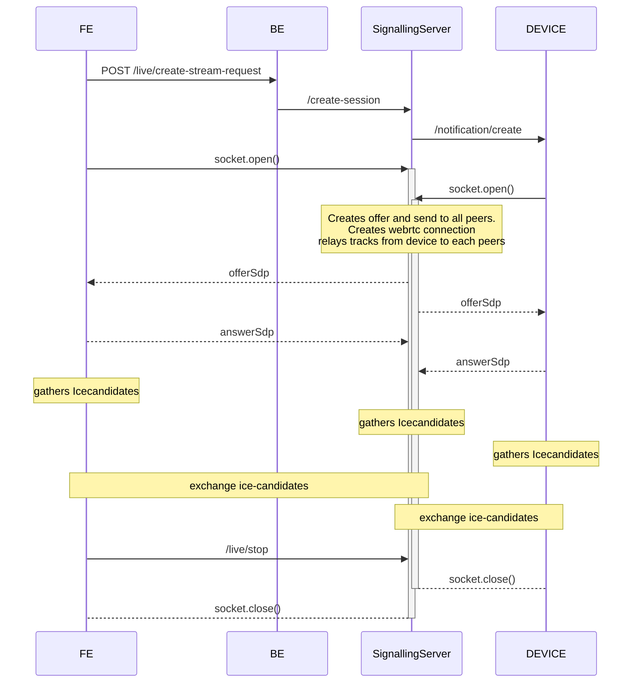
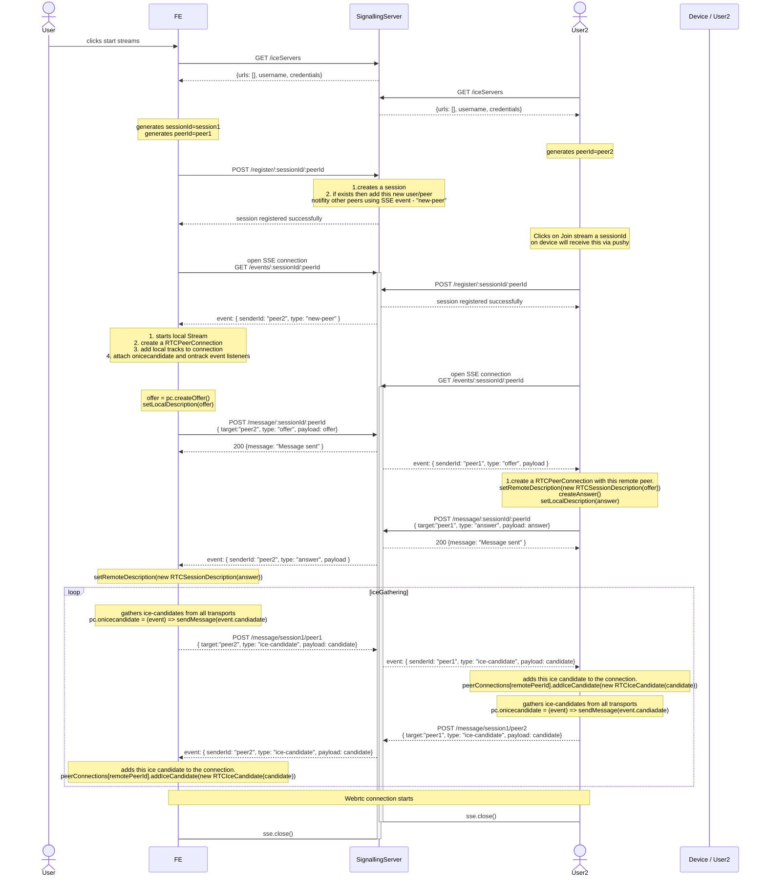

# Webrtc

## Sequence Diagram

### Using Socket.io



### using SSE



## API

api : <https://api-dt1-dev-aps1.lightmetrics.co:3478/>

Browser client: <https://api-dt1-dev-aps1.lightmetrics.co:3478/>

### GET /iceServers

Description: Get iceServers
Response:

```
{
 "urls": [
     "stun:stun.cloudflare.com:3478",
     "turn:turn.cloudflare.com:3478?transport=udp",
     "turn:turn.cloudflare.com:3478?transport=tcp",
     "turns:turn.cloudflare.com:5349?transport=tcp"
 ],
 "username": "g00e2b2824d2d1badbc66c1326f4812bac9445546493cff5e0f99b2b2c0a5023",
 "credential": "75b1e95be44b68eb9725a7ae72c0b8ec768047745ff60148f8d713e6ea4c0b47"
}
```

### POST /register/:sessionId/:peerId

Description:

1. Use this API to register/initiate a webrtc session
2. sessionId: a unique identifier for a session
3. peerId: an identifier to identify peers present in that session. [ ex: combination of (clientId, fleet and userId) for browser peers. for device it is (clientId, fleetId, and deviceId) ]
4. on BE, a session is created for the first time and if for the same sessionId another peerId registers then that peerId is registered for this existing session.
5. Sends a new-peer event to all SSE connected peers to this session.

### POST /message/:sessionId/:peerId

Request Body:

```
{
  type,
  payload,
  target
}
```

Description:

1. forwards these messages to the target peerId using existing SSE connection.
2. Can be used to forward offer, answer, ice-candidates

### GET /events/:sessionId/:peerId

Description: Open a server sent event connection to receive messages from other peers in the session via SSE.

```

## ping

{
 "time": "2025-02-14T11:19:47.726Z",
 "type": "ping"
}

## new-peer
{
 "type": "new-peer",
 "senderId": "",
}

## offer
{
 "type": "offer", // or "answer", "ice-candidate"
 "payload",
 "senderId": ""
}

```
